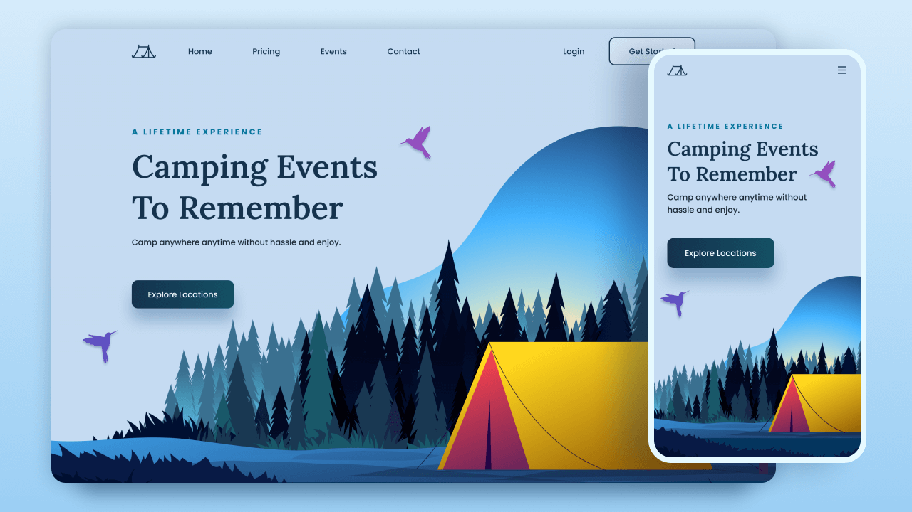

# Responsive Camping Website

This project is a responsive camping website showcasing various camping events and locations. The website is designed to be visually appealing and user-friendly, providing an immersive experience for users interested in outdoor adventures.

## Live Demo

https://camping-anywhere.netlify.app/
## Screenshots

## Features

Responsive Design: The website is optimized for various devices, ensuring a seamless experience across desktops, tablets, and mobile phones.

Dynamic Navigation: The website includes a dynamic navigation menu that adjusts based on the device's screen size, providing easy access to different sections of the website.

Interactive Elements: Interactive elements such as buttons and animations enhance the user experience, making the website more engaging.

GSAP Animation: The website uses GSAP animation library to add smooth and attractive animations to various elements, creating a visually appealing experience for users.

Font and Color Customization: Custom fonts and colors are used to enhance the visual appeal and readability of the website, creating a cohesive and professional look.

Scroll-Based Effects: The website includes scroll-based effects that change the appearance of elements as the user scrolls, adding a dynamic element to the design.
## Technologies Used

HTML: Used to structure the content of the website.

CSS: Used for styling the website and creating responsive layouts.

JavaScript: Used for adding interactivity and dynamic behavior to the website, such as toggling the navigation menu and animating elements.

GSAP: Used for adding smooth animations to various elements of the website, enhancing the overall user experience.
## Credits

Fonts: The website uses the Poppins and Lora fonts from Google Fonts for a modern and elegant look.

Icons: Icons used in the website are from the Remixicon library, adding visual cues and enhancing the user interface.
## 🔗 Links

